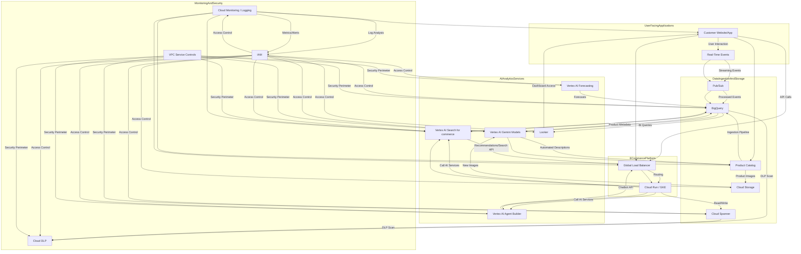

```mermaid
graph TD
    %% Define the main components and subgraphs
    subgraph UserFacingApplications
        direction LR
        A[Customer Website/App]
        B[Real-Time Events]
    end

    subgraph DataIngestionAndStorage
        direction LR
        C[Product Catalog]
        D[Cloud Storage]
        E[Pub/Sub]
        F[BigQuery]
        G[Cloud Spanner]
    end

    subgraph AIAnalyticsServices
        direction LR
        H[Vertex AI Search for commerce]
        I[Vertex AI Agent Builder]
        J[Vertex AI Gemini Models]
        K[Vertex AI Forecasting]
        L[Looker]
    end

    subgraph ECommercePlatform
        direction LR
        M[Global Load Balancer]
        N[Cloud Run / GKE]
    end

    subgraph MonitoringAndSecurity
        direction LR
        O[Cloud Monitoring / Logging]
        P[Cloud DLP]
        Q[IAM]
        R[VPC Service Controls]
    end

    %% Define the data and control flows
    A -- User Interaction --> B
    A -- API Calls --> M
    B -- Streaming Events --> E
    C -- Ingestion Pipeline --> F
    C -- Product Images --> D
    D -- New Images --> J
    E -- Processed Events --> F
    H -- Recommendations/Search API --> M
    I -- Chatbot API --> M
    J -- Product Metadata --> F
    J -- Automated Descriptions --> C
    K -- Forecasts --> F
    F -- BI Queries --> L
    L -- Dashboard Access --> A
    M -- Routing --> N
    N -- Read/Write --> G
    N -- Call AI Services --> H
    N -- Call AI Services --> I
    F -- DLP Scan --> P
    G -- DLP Scan --> P

    %% IAM edges
    Q -- Access Control --> H
    Q -- Access Control --> I
    Q -- Access Control --> J
    Q -- Access Control --> K
    Q -- Access Control --> L
    Q -- Access Control --> O
    Q -- Access Control --> P
    Q -- Access Control --> F
    Q -- Access Control --> G
    Q -- Access Control --> D

    %% VPC Service Controls edges
    R -- Security Perimeter --> H
    R -- Security Perimeter --> I
    R -- Security Perimeter --> J
    R -- Security Perimeter --> K
    R -- Security Perimeter --> P
    R -- Security Perimeter --> F
    R -- Security Perimeter --> G

    O -- Log Analysis --> Q
    O -- Metrics/Alerts --> Q

    %% Connect layers with actual node IDs, not subgraph names
    %% Data & Analytics Pipeline
    A --> C
    B --> E
    E --> F
    F --> H
    H --> F
    F --> J
    J --> C

    %% Customer Journey
    A --> M
    M --> N
    N --> H
    N --> I

    %% Security & Operations
    O --> A
    O --> C
    O --> H
    O --> M
```
